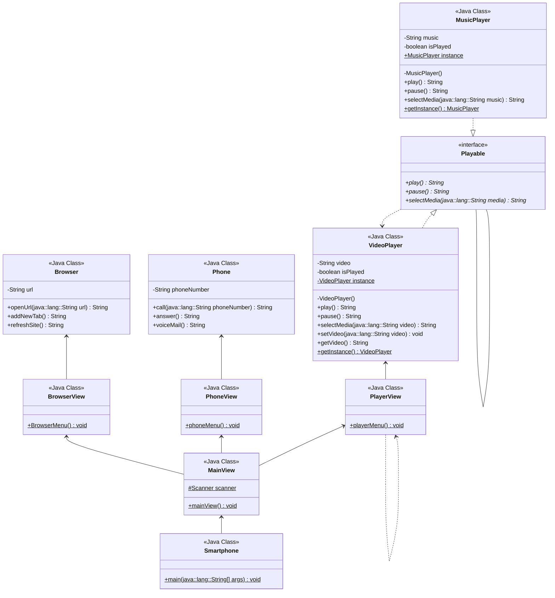

## [DIO](www.dio.me) - Trilha Java

### Desafio: Modelagem e Diagramação de um Componente iPhone

Neste desafio, foi modelado e diagramado a representação UML do componente iPhone, abrangendo suas funcionalidades como Reprodutor Musical, Aparelho Telefônico e Navegador na Internet.
Segue abaixo as funcionalidades propostas e o diagrama de classes do protótipo.

#### Funcionalidades modeladas
1. **Reprodutor Musical**
   	- Métodos: `play()`, `pause()`, `selectMedia(String media)`
2. **Aparelho Telefônico**
   - Métodos: `call(String phoneNumber)`, `answer()`, `voiceMail()`
3. **Navegador de Internet**
   - Métodos: `openUrl(String url)`, `addNewTab()`, `refreshSite()`
   
#### Diagrama de Classes
